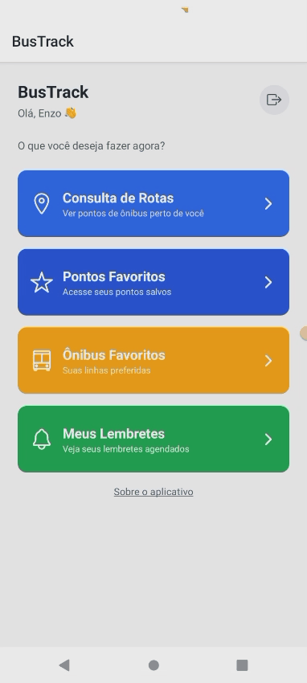

# BusTrack App – Aplicativo Mobile de Transporte Público

O **BusTrack** é um aplicativo mobile desenvolvido com **React (biblioteca para desenvolvimento mobile)**, criado para auxiliar usuários de transporte público a **localizar pontos e rotas de ônibus próximos**, organizar seus trajetos e evitar perder horários importantes.

O aplicativo conta com **login e criação de usuários**, integração com **backend próprio**, uso de **geolocalização** e funcionalidades como **favoritos** e **alarmes**.

> Projeto desenvolvido com **viés acadêmico**, porém com estrutura real de aplicação. Parte dos dados de transporte ainda está **mockada**, enquanto a autenticação e consultas de sistema já utilizam o backend publicado.

---

## 📸 Preview

 

---

## 🚍 Funcionalidades
- Cadastro e login de usuários
- Autenticação integrada ao backend (token/JWT)
- Captura da localização atual do usuário
- Consulta de pontos e rotas de ônibus próximos
- Favoritar ônibus e rotas preferidas
- Configuração de alarmes para não perder o ônibus
- Fluxo completo de navegação em aplicativo mobile

---

## 🔄 Fluxo de uso
1. Usuário cria conta ou realiza login  
2. App solicita permissão de localização  
3. Sistema consulta backend para validações e rotas  
4. Usuário visualiza pontos e ônibus próximos  
5. Usuário favorita rotas/ônibus  
6. Usuário configura alarmes para horários específicos  

---

## 🎓 Contexto do projeto
- Projeto desenvolvido **para fins acadêmicos**
- Objetivo principal: praticar **React para mobile**, integração com API e autenticação
- Dados de transporte **mockados nesta fase**
- Backend já implementado para login, autenticação e consultas
- Estrutura preparada para evolução para dados reais

---

## ☁️ Infraestrutura e Deploy
- **Banco de dados:** PostgreSQL publicado via **Supabase**
- **Backend/API:** publicado na plataforma **Render**
- **Arquitetura:** aplicativo mobile consumindo API REST com autenticação via token

Essa estrutura simula um ambiente real de produção, mesmo sendo um projeto acadêmico.

---

## 🔮 Evolução planejada
- Integração com API externa de transporte público
- Persistência real de favoritos e alarmes
- Exibição de dados em tempo real
- Sugestão inteligente de rotas com base no uso do usuário
- Melhorias contínuas de UX e performance

---

## 🛠️ Tecnologias utilizadas
- React (mobile)
- JavaScript / TypeScript (conforme implementação)
- Consumo de API REST
- Autenticação via token (JWT)
- Geolocalização do dispositivo
- PostgreSQL (Supabase)
- Backend publicado no Render
- Integração com backend próprio (BusTrack API)

---

## ▶️ Executar o projeto localmente
> Os comandos podem variar conforme o setup (Expo ou React Native CLI).

```bash
npm install
npm run start
